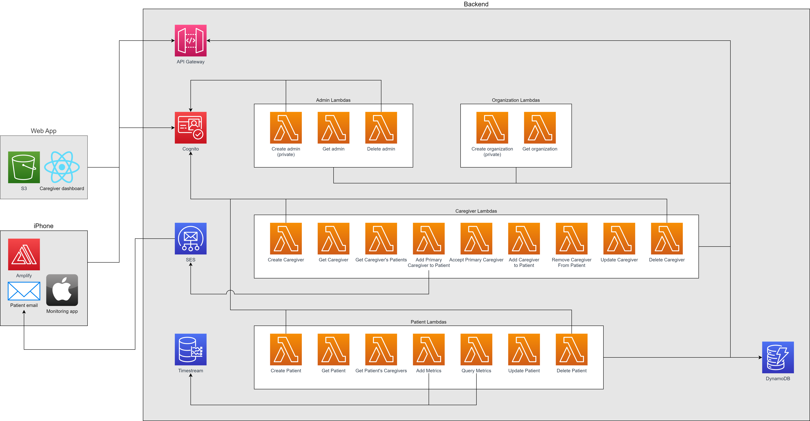

# MobiMon (Remote Mobility Monitoring)
Currently, there is no widely used mobility monitoring solution that can be used on a daily basis. Essentially, people’s metrics are shared only during weekly or monthly checkups and most often, require synchronous meetings with the patients. The CIC’s goal with this project is to tackle this problem for organizations in our community and allow for daily mobility monitoring without the need for synchronous meetings with the patient. Its impact on the community would include, but not be limited to, allowing more personalized and more frequent care for mobility-impaired patients.

| Index                                                 | Description                                               |
|:------------------------------------------------------|:----------------------------------------------------------| 
| [High Level Architecture](#High-Level-Architecture)   | High level overview illustrating component interactions   |
| [Deployment](#Deployment-Guides)                      | How to deploy the project                                 |
| [User Guide](#User-Guide)                             | The working solution                                      |
| [Changelog](#Changelog)                               | Any changes post publish                                  |
| [Credits](#Credits)                                   | Credits for this project                                  |
| [License](#License)                                   | License details                                           |

# High Level Architecture
The following architecture diagram illustrates the various AWS components utilized to deliver the solution. For an in-depth explanation of the frontend and backend stacks, refer to [Architecture Deep Dive](docs/ArchitectureDeepDive.md).

# Deployment Guides
To deploy this solution, please follow our [Deployment Guides](docs/DeploymentGuide.md).

# User Guide
For instructions on how to use the web app interface, refer to the [User Guide](docs/UserGuide.md).

# Changelog
N/A

# Credits
This project was architected and developed by Aniket Chakraborty, Daniel Ng, Leo Sun, Hung Nguyen Trong, and Roy Du, with guidance from the [UBC CIC](https://cic.ubc.ca/) technical and project management teams.

# License
This project is distributed under the [MIT License](./LICENSE).
