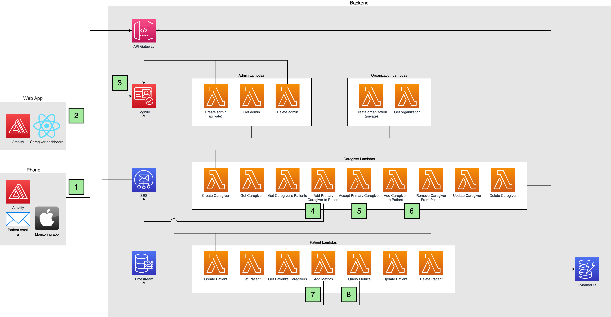

# Backend and Frontend Stack Deep Dive

## Architecture

## Description
The Architecture diagram gives insight into how patient and caregiver registration works, how patients can add mobility metrics, and how caregivers can query the metrics.

### Patient and Caregiver Registration Flow
1. Patients can sign up for accounts directly on the iOS app. The iOS app calls the Create Patient Lambda through API Gateway which creates the patient record in DynamoDB and in the Cognito user pool.
2. The web app, which is hosted through S3, allows admins to create caregiver accounts. The web app calls the Create Caregiver Lambda through API Gateway which creates the caregiver record in DynamoDB and in the Cognito user pool.
3. Patients and Caregivers can log in to their accounts through the iOS app (through Amplify) and web app respectively. The log in functionality is provided by Cognito. After logging in, the apps receive an ID token which is attached to all subsequent API calls to API Gateway, which validates the token using a Cognito Authorizer and allow the calls to proceed to the Lambdas.
4. A caregiver can request to be a primary caregiver of a patient through the web app. After the caregiver specifies the patient's email address, the web app calls the Add Primary Caregiver to Patient Lambda through API Gateway which creates a record in DynamoDB linking the patient and caregiver and specifies that the caregiver is an unverified primary caregiver of the patient. An auth code which is valid for 48 hours is generated by the Lambda and is either sent back to the web app to generate a QR code, or sent to the patient's email address as a verification link through SES.
5. The patient can either click on the verification link through email or scan the QR code on the web app using the iOS app. Either ways, the iOS app calls the Accept Primary Caregiver Lambda which verifies the caregiver and updates the record in DynamoDB. The caregiver is now a verified primary caregiver of the patient and has access to the patient's metrics.
6. The primary caregiver can share the patient with other caregivers through the web app. The web app calls the Add Caregiver to Patient Lambda which creates a record in DynamoDB linking the patient and caregiver. Caregivers can unlink themselves from patients at any time through the web app which calls the Remove Caregiver from Patient Lambda.
7. The patient sends mobility metrics to the backend through the iOS app. The iOS app calls the Add Metrics Lambda which ensures that the correct patient is sending the metrics and inserts the metrics as time-series data into Timestream.
8. The caregiver can query the metrics through the web app. The web app calls the Query Metrics Lambda which queries Timestream and returns the metrics to the web app.