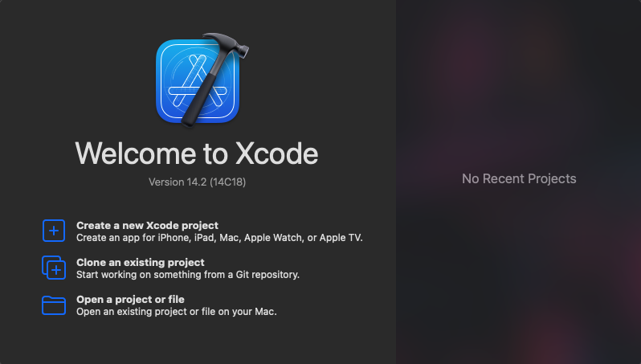
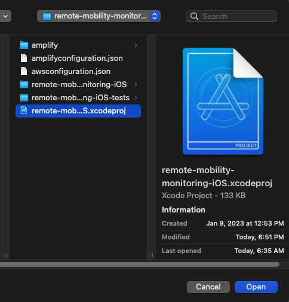
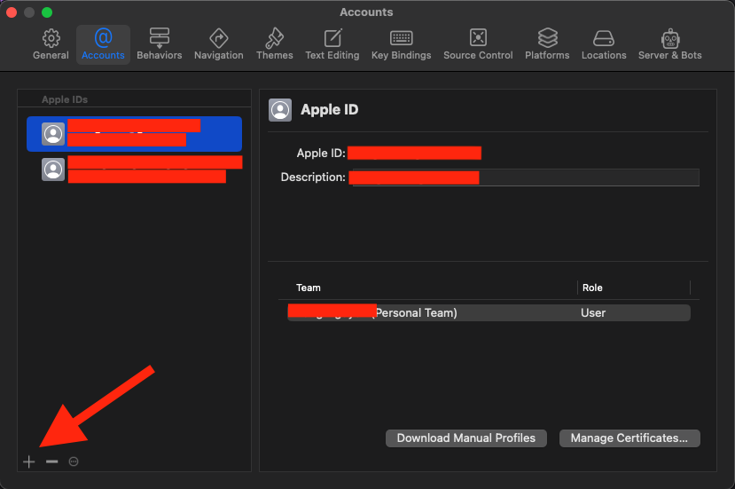
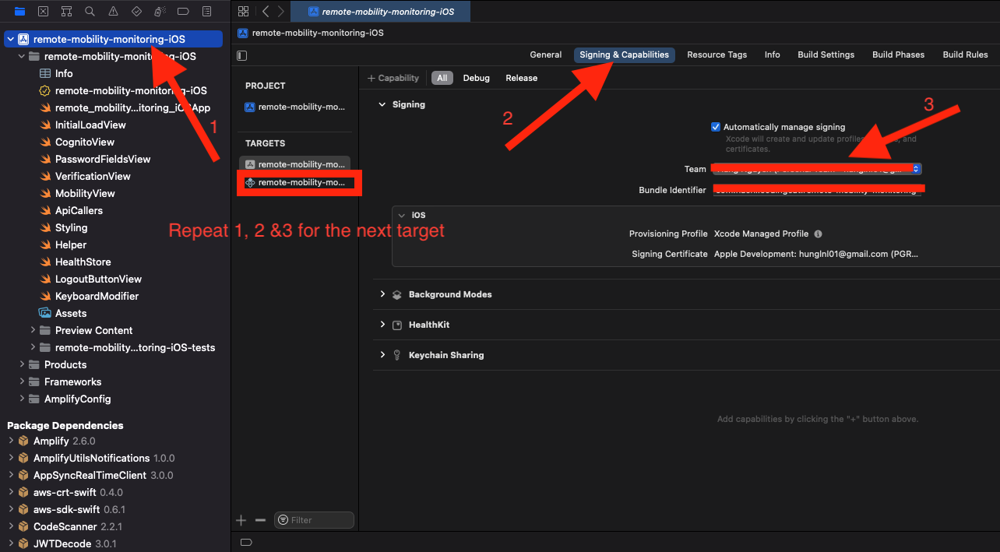
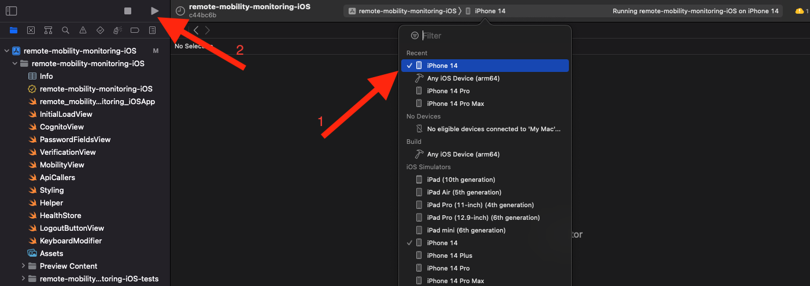
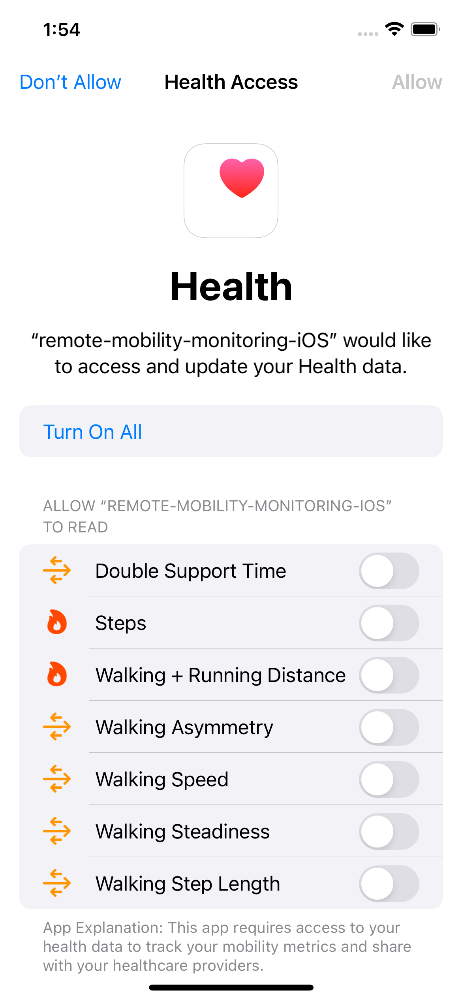

## Requirements

Before you deploy, you must have the following in place:

- [Git](https://git-scm.com/)
- [GitHub Account](https://github.com/)
- [AWS Account](https://aws.amazon.com/account/)
- [AWS CLI](https://docs.amplify.aws/cli/)
- [Amplify CLI](https://docs.amplify.aws/cli/)
- [Node.js](https://nodejs.org/en/)
- [Xcode](https://developer.apple.com/xcode/)
- [npm](https://docs.npmjs.com/getting-started)

Additionally, please complete the [backend deployment](./DeploymentGuide.md) first.

# Step 1: Clone The Repository

First, clone the GitHub repository onto your machine. To do this:

1. Create a folder on your desktop to contain the code.
2. Open terminal (or command prompt if on windows) and **cd** into the above folder.
3. Clone the GitHub repository by entering the following:

```bash
git clone https://github.com/UBC-CIC/remote-mobility-monitoring.git
```

The code should now be in the above folder. Now navigate into the iOS folder by running the following command:

```bash
cd iOS
```

# Step 2: iOS App Deployment

### Start Up XCode Project

- Start by downloading XCode from the App Store. You will require a Mac on an OS able to run XCode, an iPhone running minimum iOS 15.0.

- Now open XCode and you should see this screen.



- Next navigate to the cloned repository and open the `iOS` folder



- Double click on `remote-mobility-monitoring-iOS.xcodeproj` to start the project in XCode

### Update signing and bundle indentifiers

- Start by going to Xcode -> Settings -> Accounts and adding your Apple ID with the plus sign in the bottom left corner



- Sign up for an Apple developer account with your Apple ID if you don't have one already [here](https://developer.apple.com/account/#!/welcome).

**NOTE: Using a free developer account to build and deploy this app to a device will cause the app to stop working after 7 days. To have the app remain working indefinitely, you will need to join the paid apple development program. More information [here](https://developer.apple.com/programs/enroll/).**

- Click `remote-mobility-monitoring-iOS` -> `Signing & Capabilities`, change the team to your Apple account.
- Also change the bundle identifier to a different string, anything works as long as XCode doesn't show any errors.
- Repeat the above steps for `remote-mobility-monitoring-iOS-tests`



### Configure AWS Amplify for Cognito authentication

- Please set up Amplify for our app following these steps: [Amplify Set Up](https://docs.amplify.aws/lib/project-setup/prereq/q/platform/ios/)
- Make sure to save the `accessKeyId` and `secretAccessKey`

```bash
# Make sure to finish the Amplify Set Up guide above before proceeding

cd iOS

amplify init
# Choose AWS access keys for auth method
# Choose the user pool you created in the Backend Deployment above

amplify remove auth # Remove our existing auth
amplify add auth  # Adding your own auth with Cognito
amplify push  # Push the changes to AWS
```

**NOTE: For more information please visit [Amplify Set Up](https://docs.amplify.aws/lib/q/platform/ios/)**

### Set up .env file

- Move to `iOS/remote-mobility-monitoring-iOS` folder
- Create a Swift file called Env.swift
- Including the following content:

```swift
struct MobimonEnv {
    static let baseUrl = "YOUR_AWS_BACKEND_URL"
}
```

### Deploying to your device/simulator

- Plug in your iPhone to your Mac

- At the top of the screen select your iPhone from the list and then click the play button to run the app.



**NOTE: The very first time you build and run the app on your device, the build will fail. To fix this, go to the settings app -> General -> VPN & Device Management -> Apple Development: YourAppleID@email.com and trust the developer.**


