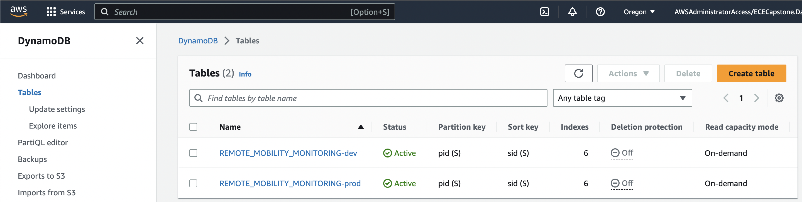
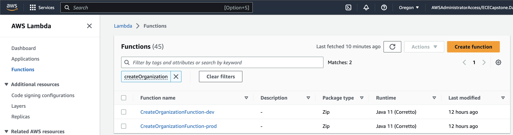
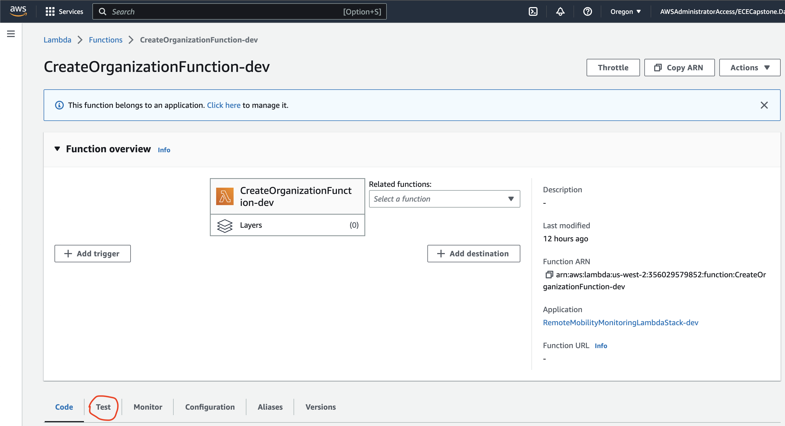
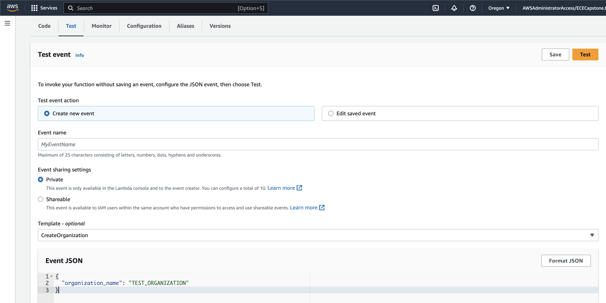
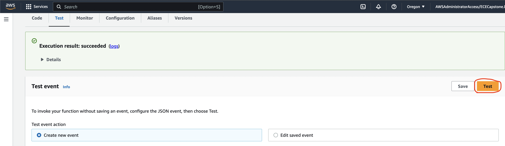
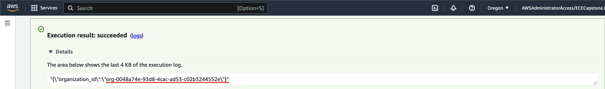
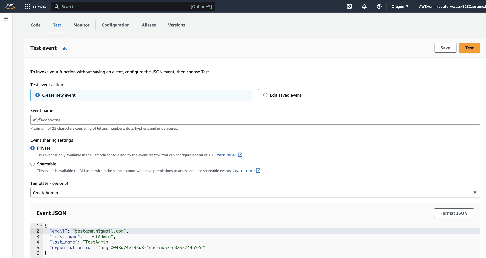
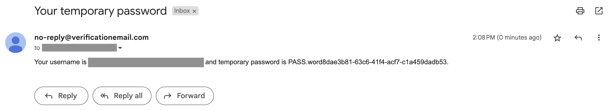

# User Guide

**Before you follow the guide, you must have the following in place:**
- [Deployment Guides](./DeploymentGuide.md)

| Index                                             | Description                                      |
|:--------------------------------------------------|:-------------------------------------------------| 
| [Create an Organization](#Create-an-Organization) | Create an organization for admins and caregivers |
| [Create an Admin](#Create-an-Admin)               | Create an admin                                  |
| [Admin Login](#Admin-Login)                       | Login as an admin                                |

## Backend Stages
All CDK stacks except for the SES stack are deployed in 2 stages: dev and prod. The dev stage is used for development and testing, while the prod stage is used for production. The SES stack is shared by both dev and prod stages, so it is only deployed once. All other stacks are deployed in dev and prod stages, an example is the DynamoDB table as follows:

It can be seen that there are 2 DynamoDB tables, one with the suffix -dev and one with the suffix -prod, indicating which stage the table belongs to. When using the AWS Console, be mindful of which stage you are using, as resources (except for SES) are not shared between stages.

## Create an Organization
An organization must be created before admins and caregivers can be created, as they must be part of an organization. To create an organization, go to the AWS Lambda console and search for `createOrganization`, the following should appear:

Click into the Lambda function of the desired stage (dev or prod), and click the `Test` button:

In the test window, enter the following JSON in the `Event JSON` section:
```json
{
  "organization_name": "YOUR ORGANIZATION NAME"
}
```
Like so:

Next, click on the orange `Test` button, and after a few seconds, the following should appear:

The organization should now be created. Expand the `Execution result` details section, and take note of the `organization_id` value, as it will be used later:


## Create an Admin
Similar to create an organization, go back to the AWS Lambda console and search for `createAdmin` and click into the Lambda function of the desired stage (dev or prod), and click the `Test` button. In the test window, enter the following JSON in the `Event JSON` section:
```json
{
  "email": "YOUR ADMIN EMAIL",
  "first_name": "YOUR ADMIN FIRST NAME",
  "last_name": "YOUR ADMIN LAST NAME",
  "organization_id": "YOUR ORGANIZATION ID"
}

```
Like so:

After clicking on the orange `Test` button, the admin should be created and an email containing the admin's temporary password should be sent to the admin's email address. The email should look like this:

The admin can then use the temporary password to log in to the web app and change their password.

## Admin Login
