# User Guide

**Before you follow the guide, you must have the following in place:**

- [Deployment Guides](./DeploymentGuide.md)

| Index  
|:--------------------------------------------------|
| [Admin creates a caregiver](#admin-creates-a-caregiver) | Login as an admin |
| [Patient creates an account](#patient-creates-an-account) |
[Caregiver links a patient](#caregiver-links-a-patient)|
[Patient uploads mobility metrics](#patient-uploads-mobility-metrics)|
[Caregiver views metrics](#caregiver-views-metrics)|
[Caregiver shares metrics with another caregiver](#caregiver-shares-metrics-with-another-caregiver)

## Admin creates a caregiver

Once an admin is [created](./BackendDeploymentGuide.md#create-an-admin), the admin can log in as follows:
Click on the login here button as shown below:

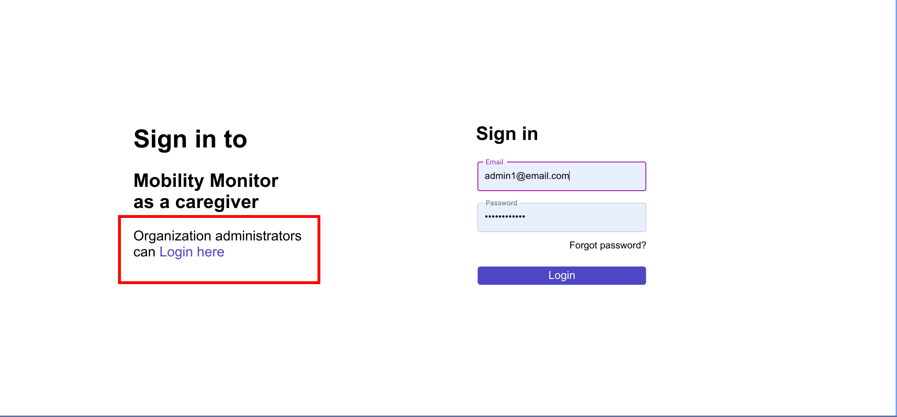
Then click on login. Next, click on the add new caregiver button:

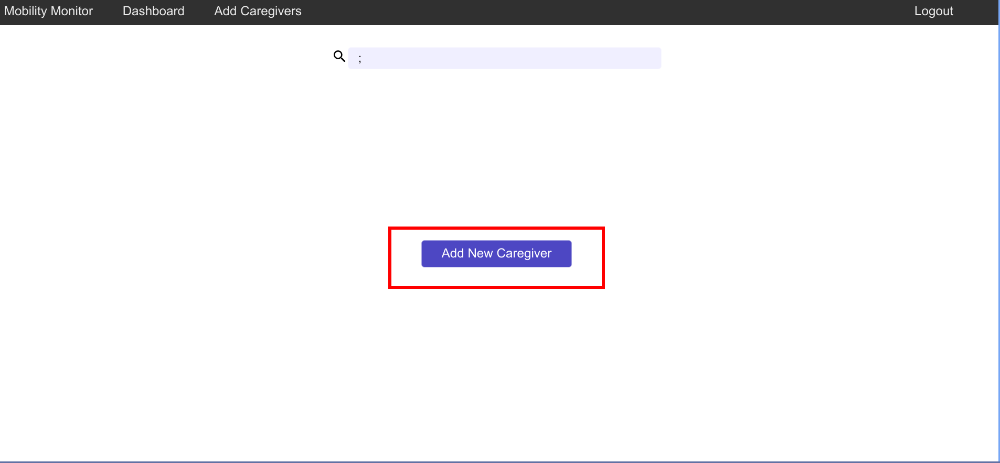
You will be redirected to a page to fill in caregiver information. Once you are done, click add caregiver. An email will be sent to the caregiver with instructions to set their password.

## Patient creates an account

When the patient first open the app, he/she needs to grant access to mobility metrics. Click on the bottom link to switch to the signup page. Fill out all the required fields then click `Sign Up` button. You'll be auto redirected back to the Sign In page with email and password filled out. Click the `Sign In` button to authenticate.

<table>
  <tr>
    <td>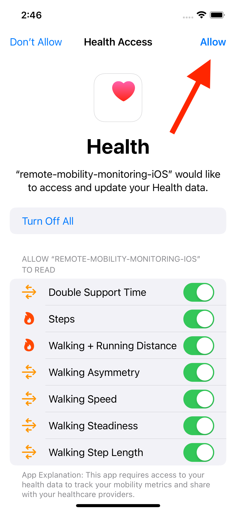</td>
    <td>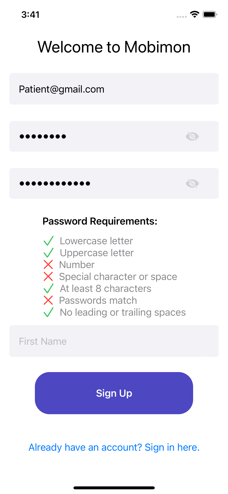</td>
    <td>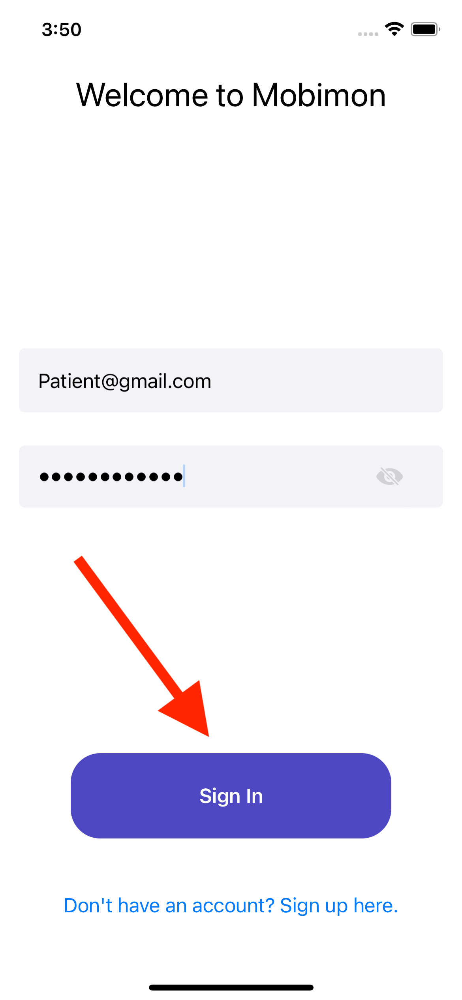</td>
  </tr>
</table>

## Caregiver links a patient

First, a caregiver must log in with their email and password. Then, they must click on the add a new patient button as follows:
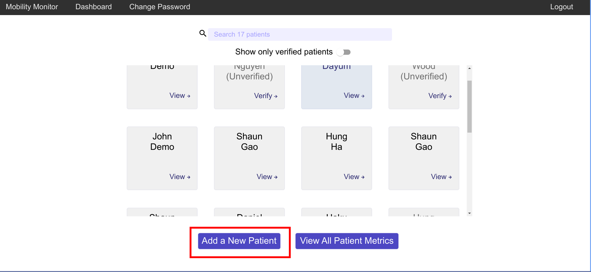
Then, they can enter the email of the patient they wish to link and click on the add patient button. Finally, they will be brought to the following page:
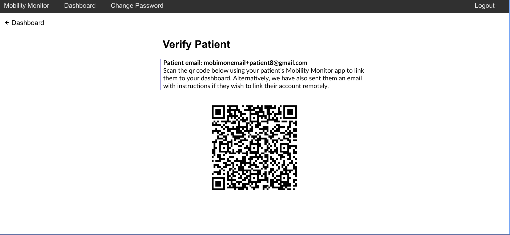
Now there are two options.

Option 1: The patient can scan this qr code using their mobile app as follows:

  <kbd>
    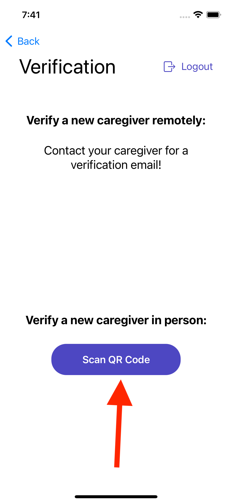
  </kbd>

Once the qr code is scanned, the patient is automatically linked to the caregiver.

Option 2: If the patient want to be linked remotely, they will also get an email with a verification link as follows:

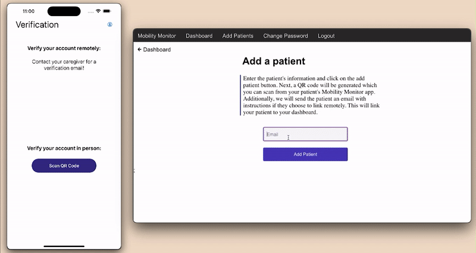

The patient simply has to open this link and they will be verified

## Patient uploads mobility metrics

Once patient is already linked to at least one caregiver, the patient can view and send mobility metrics by clicking `Send Data`. Alternatively, the mobility data is also automatically uploaded in the background once every hour.

  <kbd>
    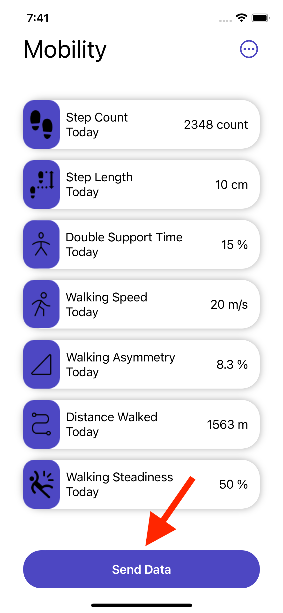
  </kbd>

## Caregiver views metrics

To view the metrics the caregiver simply has to click on a patient from their dashboard like so:
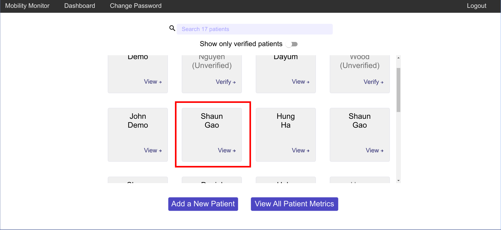

Once the caregiver clicks on this patient, they will be brought to a page that displays the patient's metrics in graphs and a table:
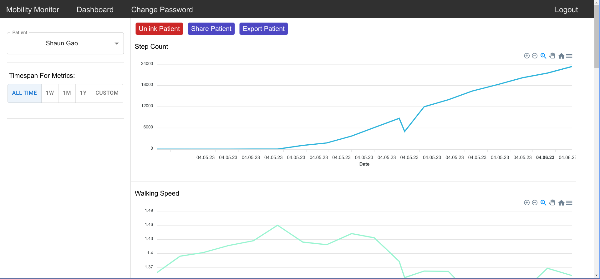
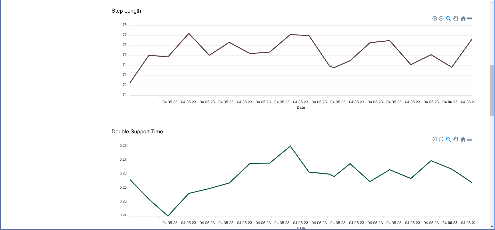
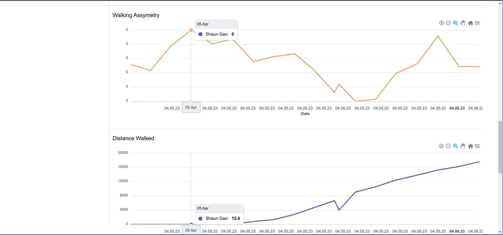

TODO (Aniket) add graph and table after new metric is complete

The caregiver can also view the metrics of all their patients. To do so, the caregiver clicks on the view all patient metrics button:
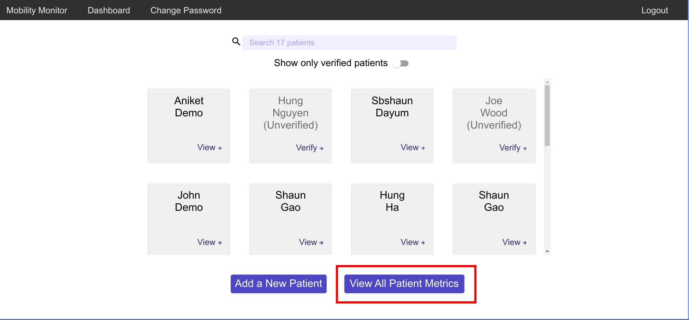

This brings them to a page where they can view the metrics of all their patients in graphs as shown:

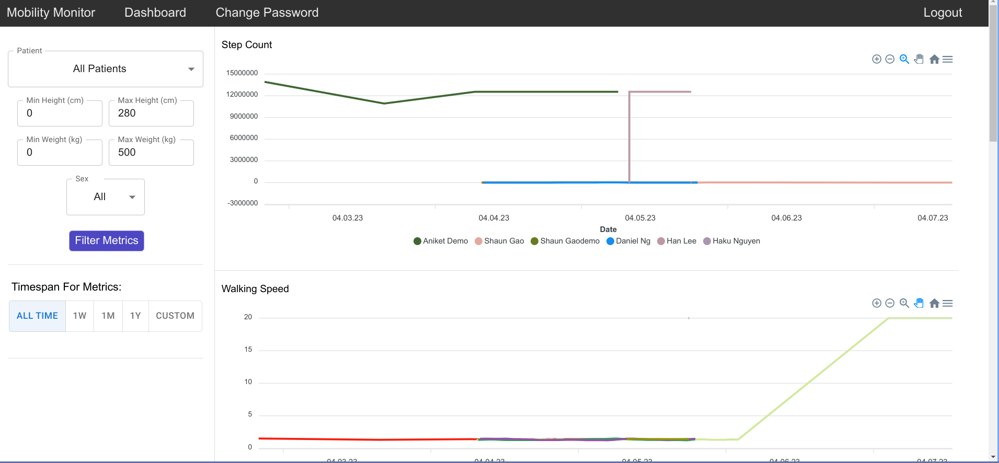

Additionally, the caregiver can also filter the patients by their height, weight, and sex:

Additionally, for both single patient and mutli-patient views, the caregiver can query the metrics by time:

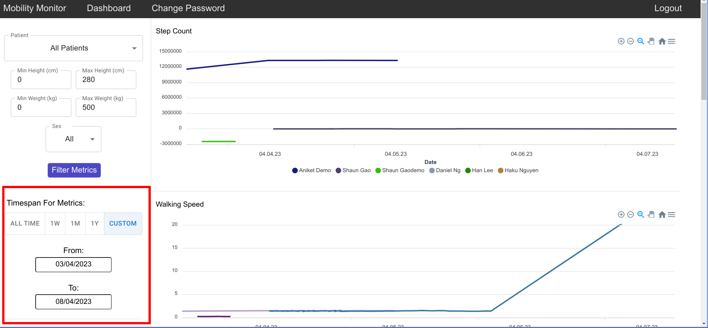

A caregiver can also export these metrics. Lastly, a caregiver can unlink a patient by clicking on the Unlink Patient button

## Caregiver shares metrics with another caregiver

A caregiver can also share a patient's metrics with another caregvier within a same organization. To do so, the caregiver goes to a selected patient's view and clicks on the share patient button:
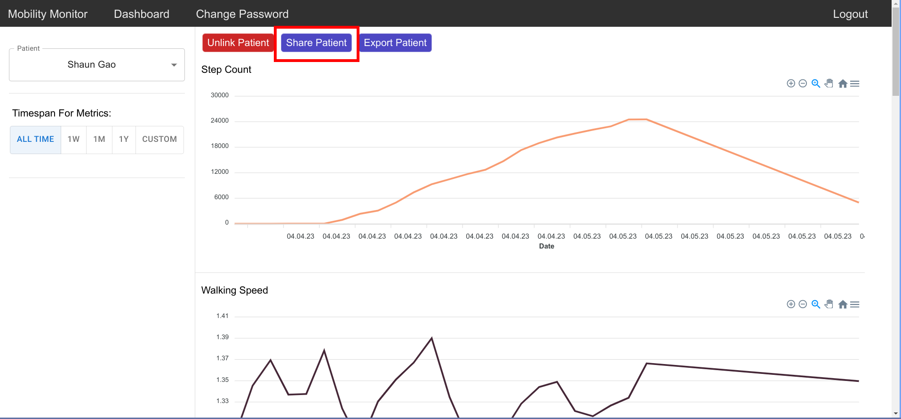

This brings up a view with all the caregivers in the organization. You can search for caregivers and simply click on one of them to share the patient metrics:

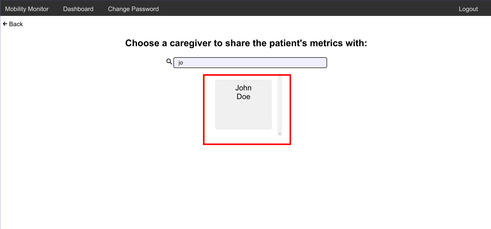
