# Requirements
Before you deploy, you must have the following in place:
*  [Git](https://git-scm.com/)
*  [GitHub Account](https://github.com/)
*  [AWS Account](https://aws.amazon.com/account/)
*  [AWS CLI](https://aws.amazon.com/cli/)
*  [Node.js](https://nodejs.org/en/)

Additionally, please complete the [backend deployment](./BackendDeploymentGuide.md) first.

# Step 1: Clone The Repository
First, clone the GitHub repository onto your machine. To do this:
1. Create a folder on your desktop to contain the code.
2. Open terminal (or command prompt if on windows) and **cd** into the above folder.
3. Clone the GitHub repository by entering the following:
```bash
git clone https://github.com/UBC-CIC/remote-mobility-monitoring.git
```

The code should now be in the above folder. Now navigate into the remote-mobility-monitoring folder by running the following command:
```bash
cd remote-mobility-monitoring
```

# Step 2: Webapp Deployment
1. Create a profile for the AWS CLI using the instructions in the [AWS CLI docs](https://docs.aws.amazon.com/cli/latest/userguide/cli-authentication-short-term.html). For example, create a profile as follows:
    ```
    [cic]
    sso_start_url = <YOUR_AWS_SSO_URL>
    sso_region = <YOUR_AWS_SSO_REGION>
    sso_account_id = <YOUR_ACCOUNT_ID>
    sso_role_name = AWSAdministratorAccess
    region = us-west-2
    output = json
    ```
    Then you can log in to your aws profile on the terminal as follows:
    ``` bash
    aws sso login --profile cic
    ```
2. Create a new AWS S3 bucket by specifying a new bucket name:
   ``` bash
   aws s3 mb s3://<YOUR_BUCKET_NAME> --profile cic
   ```
   Note that this bucket name has to be unique globally across S3. To check that it has been successfully created use the following command:
   ```
   aws s3 ls --profile cic
   ```
   Example output:
   ```
   2023-04-07 18:53:11 <YOUR_BUCKET_NAME>
   ```
3. Navigate to the webapp directory in the terminal. For example:
    ```
    cd webapp
    ```
4.  Collect the necessary env variables as follows:

    * **API Gateway Url**

        Search for API Gateway, and then navigate to it:
    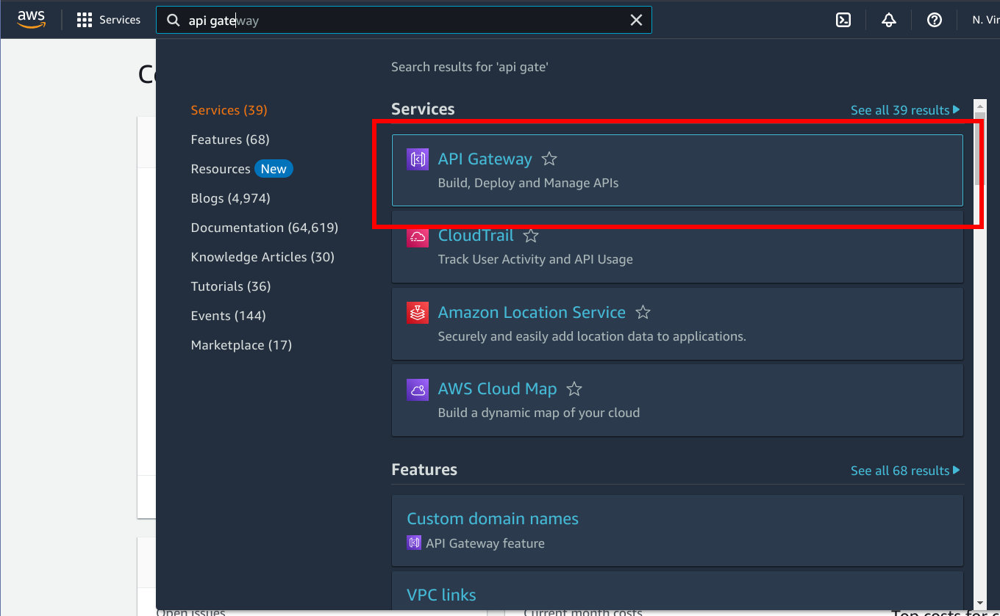
        Next, pick the desired api collection. If you're developing, use dev and if it's production then use prod:
        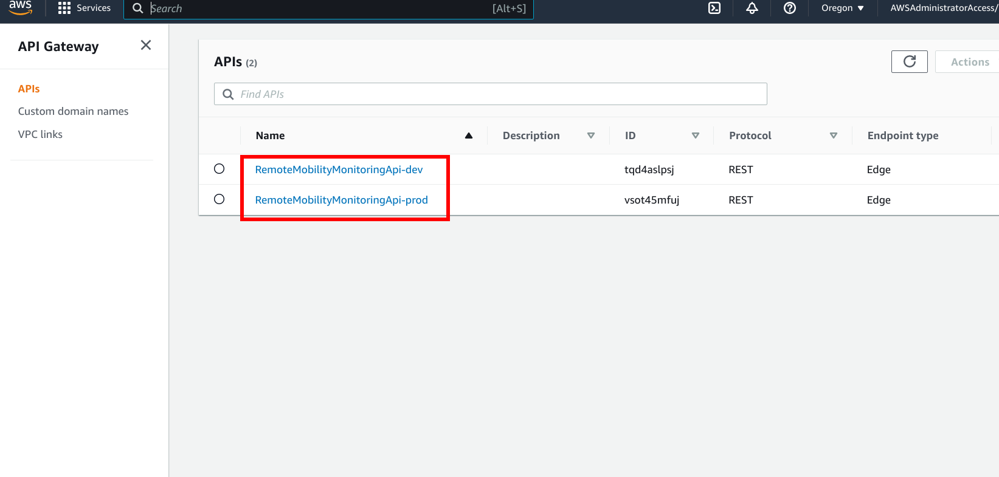
        Click on stages:
        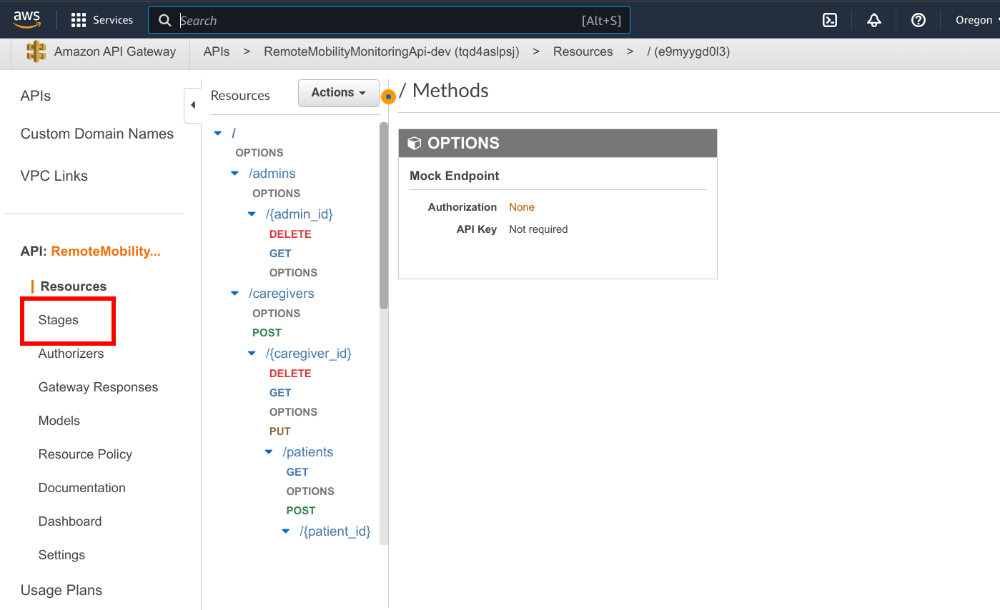
        Then, click on prod and save the invoke url for later:
        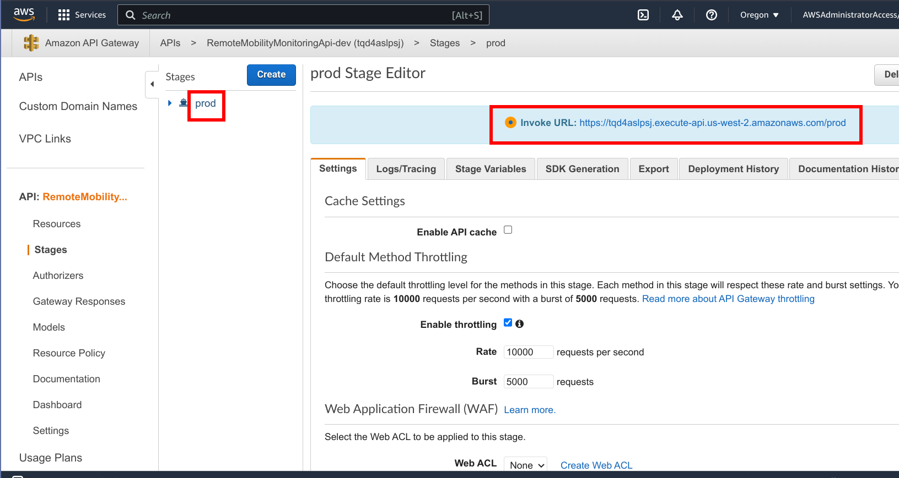
    * **Cognito User Pool**

        Search for Cognito and then navigate to it:
        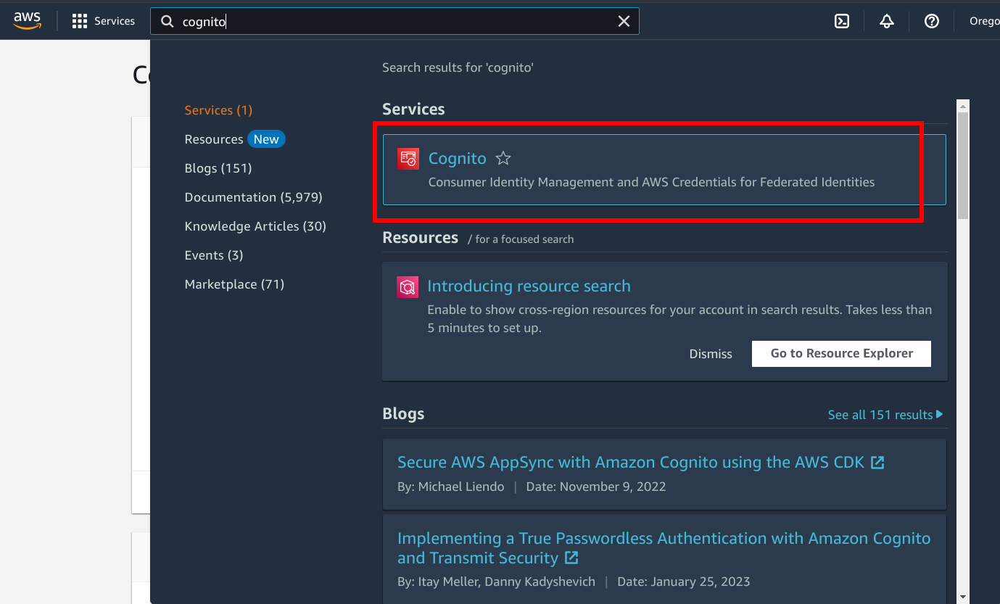
        Click on the appropriate user pool. The selected user pool should be consistent with the API Gateway. For example, if you chose dev in the API Gateway then chose dev for cognito as well. 
        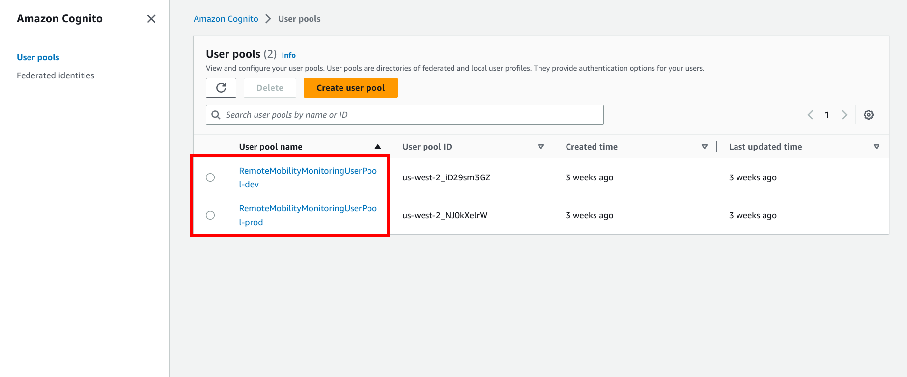
        Next, copy the user pool id and save it for later:
        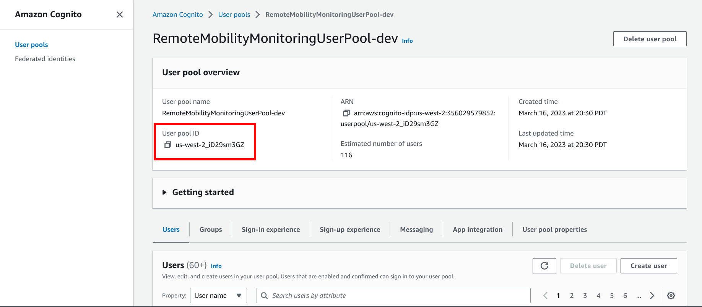 

    * **Cognito Client Id**

        In the same Cognito page, navigate to App Integration:
        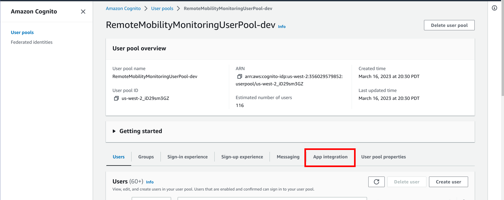
        Scroll down to App client list and copy the client ID for later:
        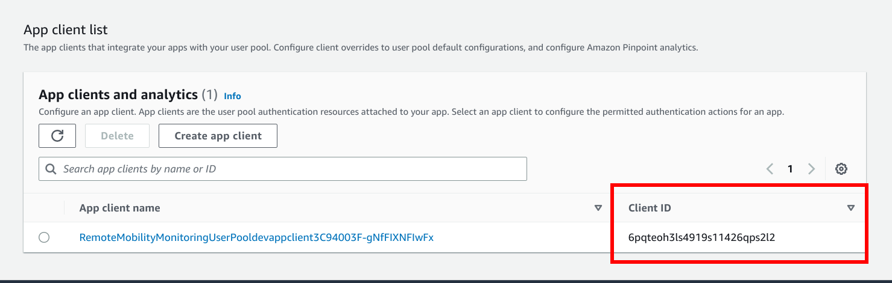
    * **Organization ID**

        The organization id is the same as the one that was created during the [backend deployment](./BackendDeploymentGuide.md#create-an-organization). If you have forgotten the org ID, you can follow these steps to retrieve it:
        Navigate to Dynamo:
        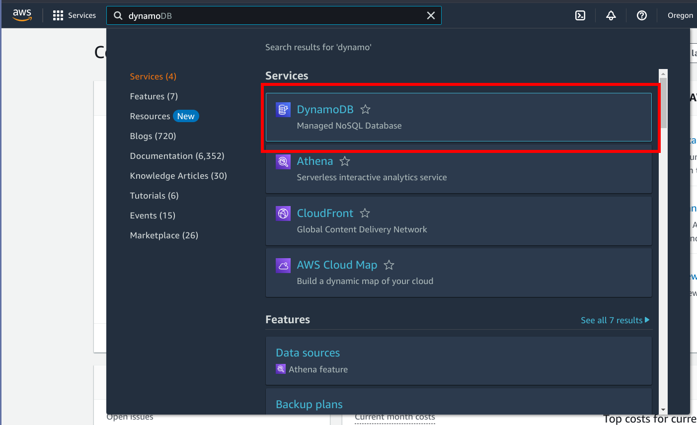
        Click on tables on the left bar:
        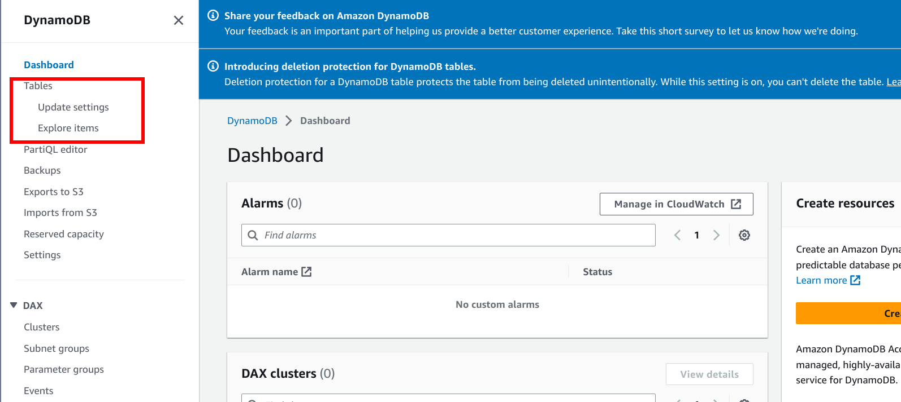
        Select the appropriate table name based on if you picked dev or prod for API gateway. For example, if you picked dev in gateway, you should also pick dev in dynamo db:
        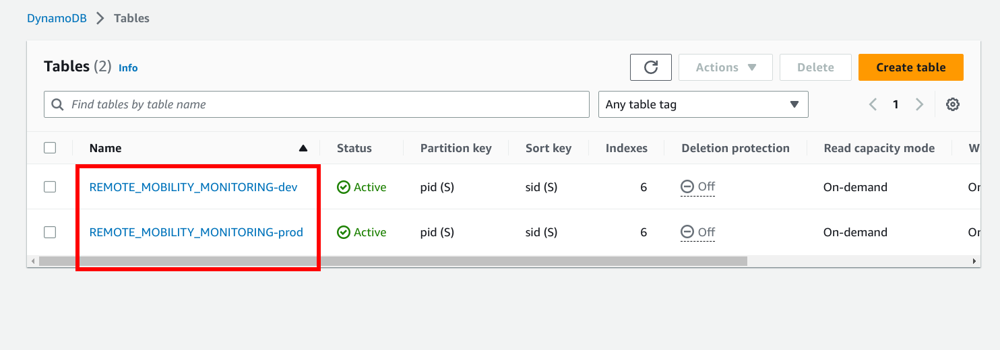
        Click on explore table items:
        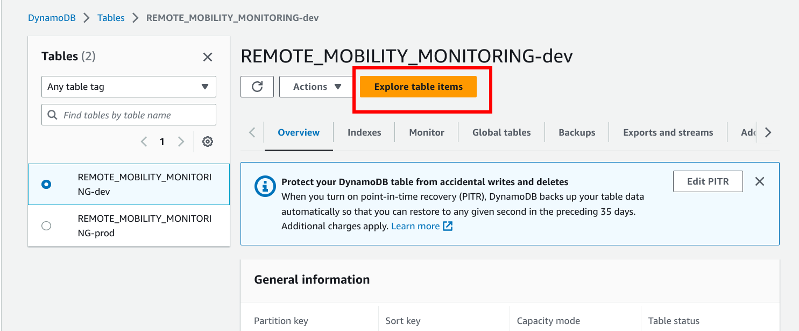
        Fill in the filter with attribute name = pid, condition = begins with, and value = org and click on run as follows:
        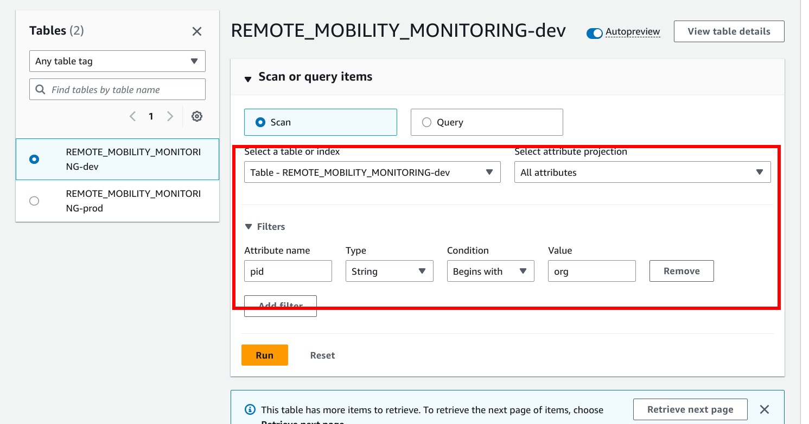
        Finally, copy one of the organization ids from the pid columns as follows:
        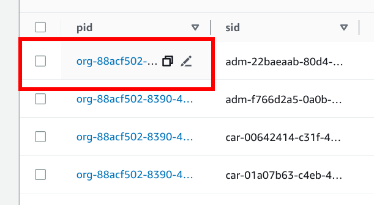
        Note that if all steps were followed correctly, if there is more than one row after the filter, the values in the pid column should all be equal. Therefore, you can copy any one of them. 


    Now, copy the "example.env" file to a new file with name ".env" and fill in the following information:
    ```
    REACT_APP_API_URL=<YOUR_AWS_API_GATEWAY_URL>
    REACT_APP_USER_POOL_ID=<YOUR_COGNITO_USER_POOL_ID>
    REACT_APP_CLIENT_ID=<YOUR_COGNITO_CLIENT_ID>
    REACT_APP_ORG_ID=<YOUR_ORGANIZATION_ID>
    REACT_APP_KEY=<YOUR_KEY>
    ```
    Note here that <YOUR_KEY> is an arbitrary set of characters that the user can specify themselves. Please ensure that there are at least 15 characters with letter, numbers, and special characters for safety.
5. Install the packages for the React applications as follows:
    ```
    npm install
    ```
    Optionally, you can test to see if the dependencies were properly installed and the app runs as expected by running it locally. To do so, run the following command:
    ```
    npm start
    ```
    A local development server should automatically be started where you can use the webapp.
6. Now, you can build the React app for production. To do so run the following command:
    ```
    npm run build
    ```
7. Now, use the AWS CLI to upload the build files to the s3 bucket that you created. To do so, run this command:
    ```
    aws s3 sync build/ s3://<YOUR_BUCKET_NAME> --profile cic
    ```
    Note that if you used a different profile instead of cic, then specify that profile name after the --profile flag instead of cic. 

8. Next, we specify that the uploaded files should be a website with the index file index.html. To do so, run the following command:
    ```
    aws s3 website s3://<YOUR_BUCKET_NAME> --index-document index.html --error-document index.html --profile cic
    ```
    Note that you can replace cic with your own profile if you used a different one.
9. Finally, we make the website public. First, open the policy.json file and replace <YOUR_BUCKET_NAME> with your created bucket name. Then run the following command:
    ```
    aws s3api put-bucket-policy --bucket <YOUR_BUCKET_NAME> --policy file://policy.json --profile cic
    ```
The webapp should now be deployed. The url is as follows:

http://<YOUR_BUCKET_NAME>.s3-website-<YOUR_REGION>.amazonaws.com/

To see the url, you can navigate to S3, click on the bucket you just created, click on Properties and scroll down to Static website hosting. The url will be shown as follows:
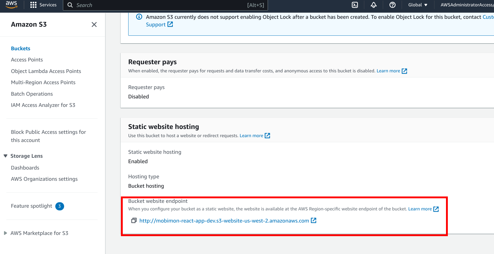


