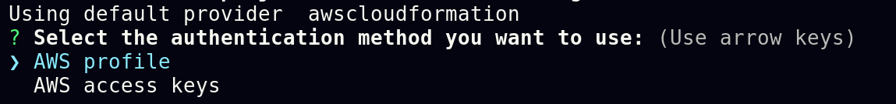
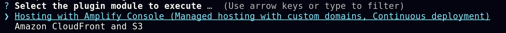
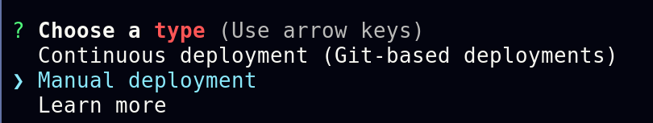
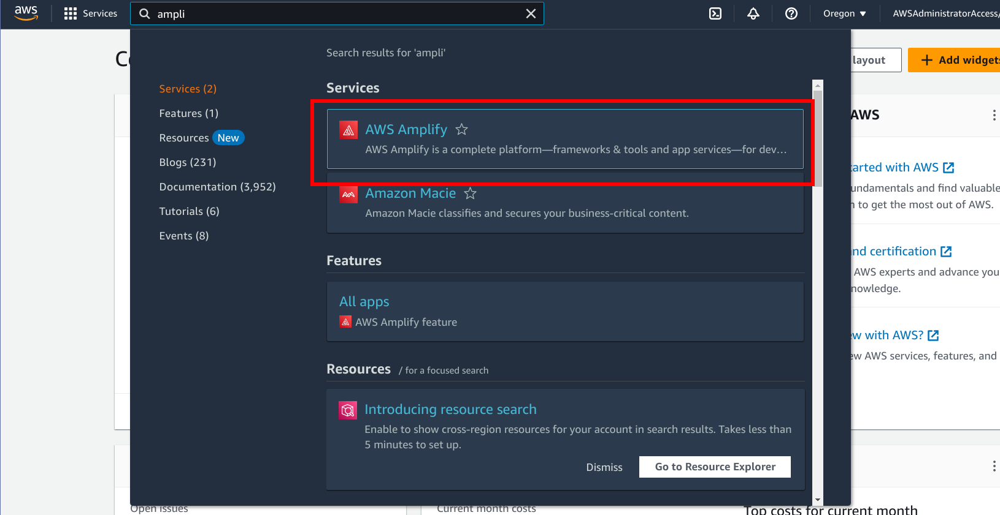
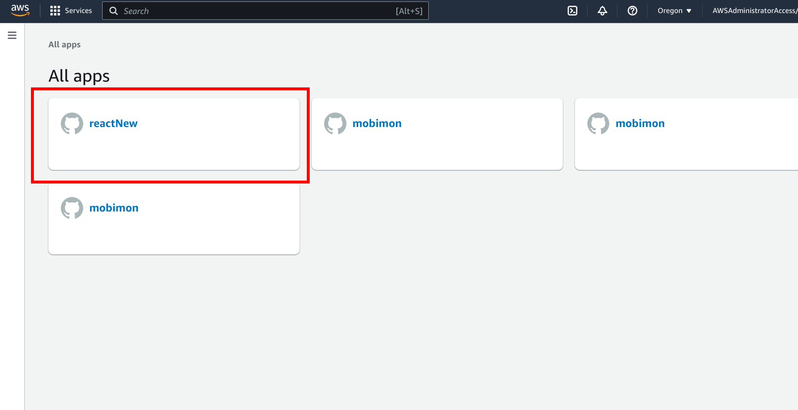
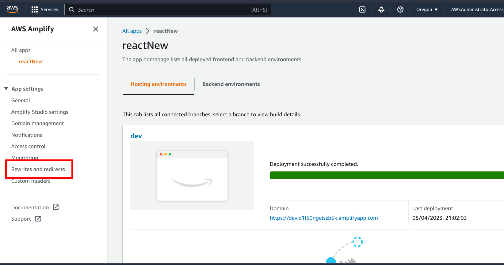
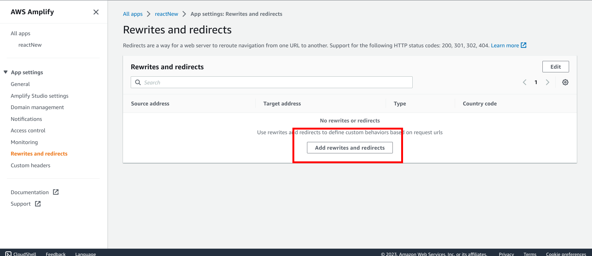
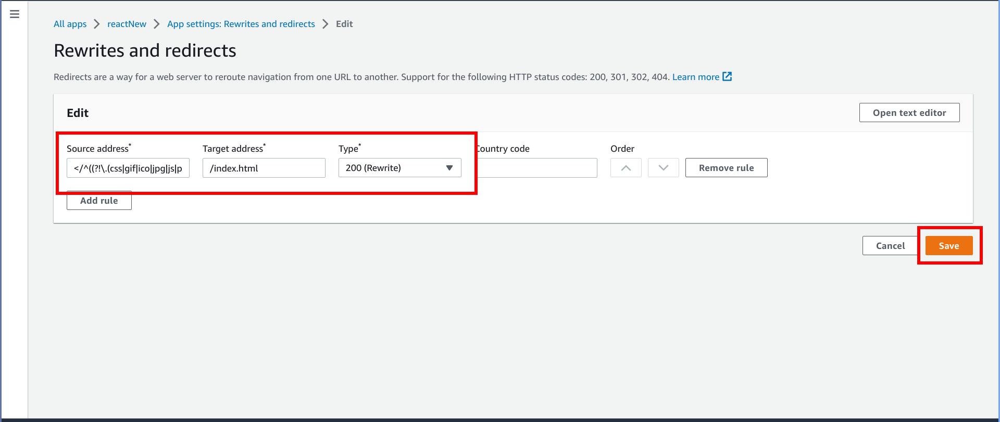

# Requirements
Before you deploy, you must have the following in place:
*  [Git](https://git-scm.com/)
*  [GitHub Account](https://github.com/)
*  [Node.js](https://nodejs.org/en/)
*  [AWS Account](https://aws.amazon.com/account/)
* [Amplify CLI](https://docs.amplify.aws/cli/start/install/) (Remember the profile name you created)


Additionally, please complete the [backend deployment](./BackendDeploymentGuide.md) first.

## Step 1
Navigate to the webapp folder in the cloned repsoitory:
```
cd webapp
```

## Step 2 
Ensure that you have completed the [Amplify CLI](https://docs.amplify.aws/cli/start/install/) setup. You need to remember the profile you created on the command line. 

## Step 3
In the webapp directory, we will initialize the amplify hosting. To do so, run the following command:
```
amplify init
```
Specify a name for the project. **Note:** Remember this project name for later.

Then specify the configuration. It should be ok to accept the default configuration but ensure it matches the following:
```
Project information
| Name: <YOUR_PROJECT_NAME>
| Environment: dev
| Default editor: Visual Studio Code
| App type: javascript
| Javascript framework: none
| Source Directory Path: src
| Distribution Directory Path: dist
| Build Command: npm run-script build
| Start Command: npm run-script start
```
Then select AWS profile for the authentication method:



Then, select the profile you created during the [Amplify CLI setup](#step-2)

## Step 4
Next, you need to add the react app to the initiated amplify app. To do so, run the following command:
```
amplify add hosting
```
When prompted for the plugin module to execute, select Hosting with Amplify Console as follows:



Then pick Manual Deployment for type:



## Step 5
Next, you should collect the necessary env variables for the react app as follows:

* **API Gateway Url**

    Search for API Gateway, and then navigate to it:

    

    Next, pick the desired api collection. If you're developing, use dev and if it's production then use prod:

    

    Click on stages:

    

    Then, click on prod and save the invoke url for later:

    

* **Cognito User Pool**

    Search for Cognito and then navigate to it:

    

    Click on the appropriate user pool. The selected user pool should be consistent with the API Gateway. For example, if you chose dev in the API Gateway then chose dev for cognito as well. 

    

    Next, copy the user pool id and save it for later:

     

* **Cognito Client Id**

    In the same Cognito page, navigate to App Integration:

    

    Scroll down to App client list and copy the client ID for later:

    

* **Organization ID**

    The organization id is the same as the one that was created during the [backend deployment](./BackendDeploymentGuide.md#create-an-organization). If you have forgotten the org ID, you can follow these steps to retrieve it:
    Navigate to Dynamo:

    

    Click on tables on the left bar:

    

    Select the appropriate table name based on if you picked dev or prod for API gateway. For example, if you picked dev in gateway, you should also pick dev in dynamo db:

    

    Click on explore table items:

    

    Fill in the filter with attribute name = pid, condition = begins with, and value = org and click on run as follows:

    

    Finally, copy one of the organization ids from the pid columns as follows:

    

    Note that if all steps were followed correctly, if there is more than one row after the filter, the values in the pid column should all be equal. Therefore, you can copy any one of them. 


    Now, copy the "example.env" file to a new file with name ".env" and fill in the following information:
    ```
    REACT_APP_API_URL=<YOUR_AWS_API_GATEWAY_URL>
    REACT_APP_USER_POOL_ID=<YOUR_COGNITO_USER_POOL_ID>
    REACT_APP_CLIENT_ID=<YOUR_COGNITO_CLIENT_ID>
    REACT_APP_ORG_ID=<YOUR_ORGANIZATION_ID>
    REACT_APP_KEY=<YOUR_KEY>
    ```
    Note here that <YOUR_KEY> is an arbitrary set of characters that the user can specify themselves. Please ensure that there are at least 15 characters with letter, numbers, and special characters for safety.

## Step 6

Install the packages for the React applications as follows:
```
npm install
```
Optionally, you can test to see if the dependencies were properly installed and the app runs as expected by running it locally. To do so, run the following command:
```
npm start
```
A local development server should automatically be started where you can use the webapp.

## Step 7

Now you are ready to publish the website. To do so, run the following command:
```
amplify publish
```
Choose Y when prompted if you're sure you want to continue.

You should now have a url with your website hosted

## Step 8

Since we're using react-router, we need to specify that all routes should be redirected to index.html. To do so, first navigate to the Amplify page in the AWS console:



Next, click on the amplify app you created during step 3. 



Next, click on Rewrites and redirects button located in the left sidebar:



Click on the Add rewrites and redirects button:



Enter in the following information and click on save:

```
Source Address: </^((?!\.(css|gif|ico|jpg|js|png|txt|svg|woff|ttf)$).)*$/>
Target: /index.html
Type: 200 (Rewrite)
```



The webapp should now be publically acessible


